## Hi My name is cuBerry ~ Thanks for visiting my github.
This is my Portfolio.

## Korean Version
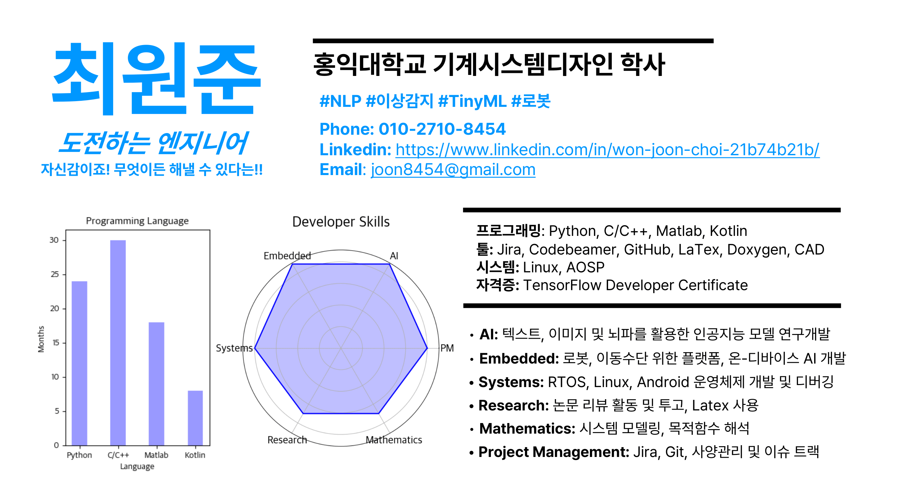
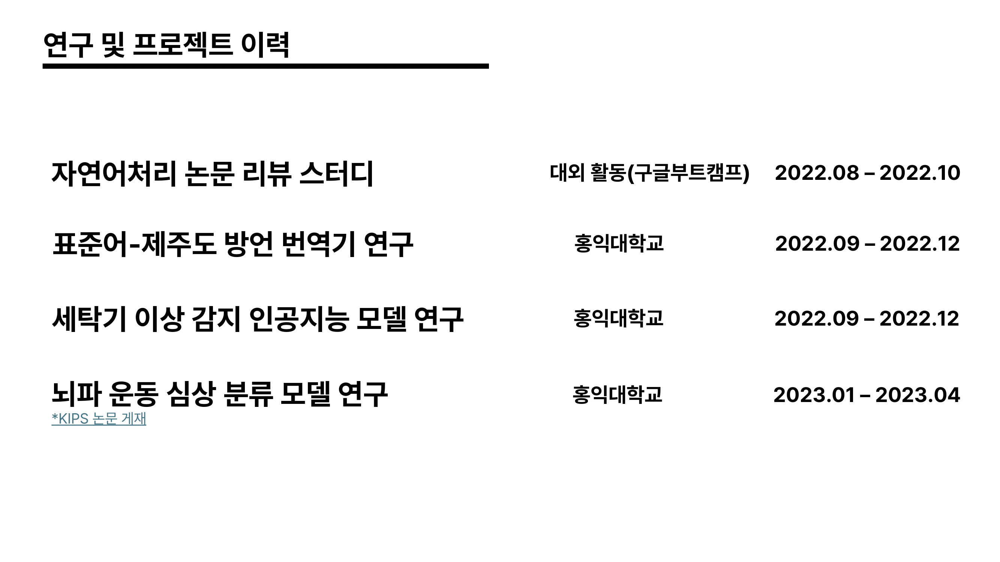
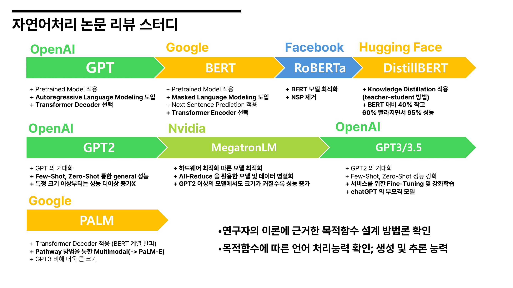
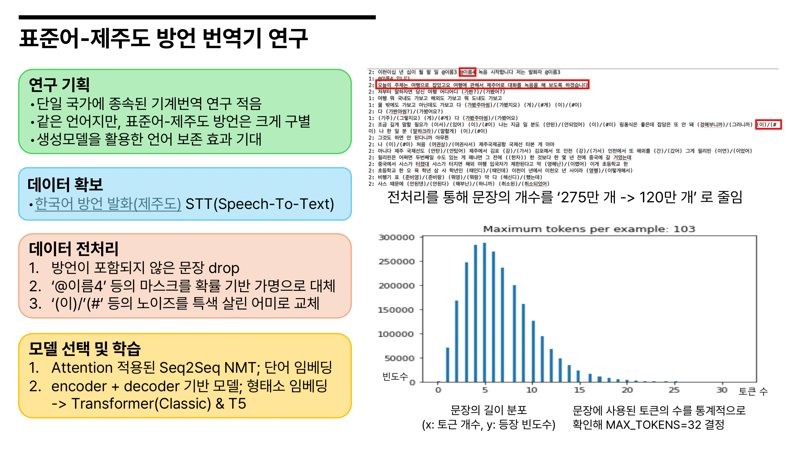
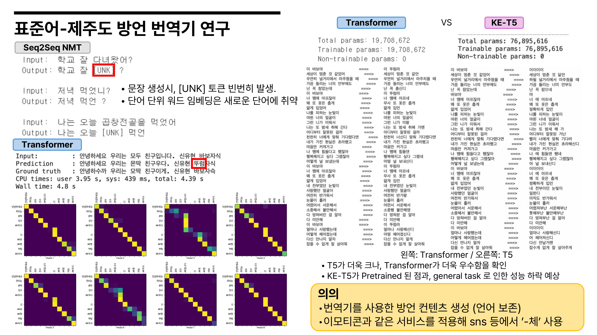
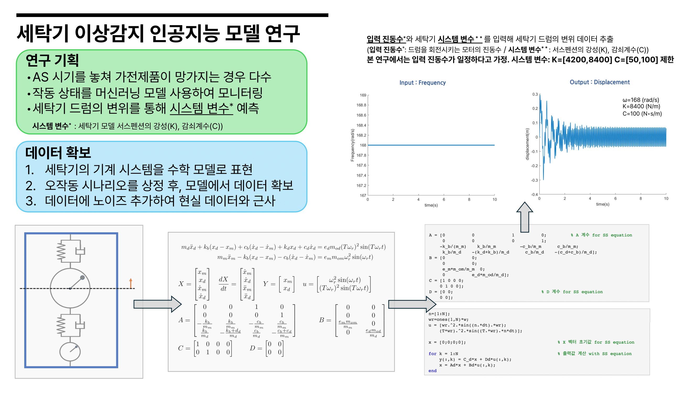
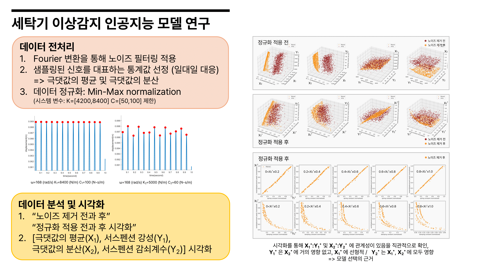
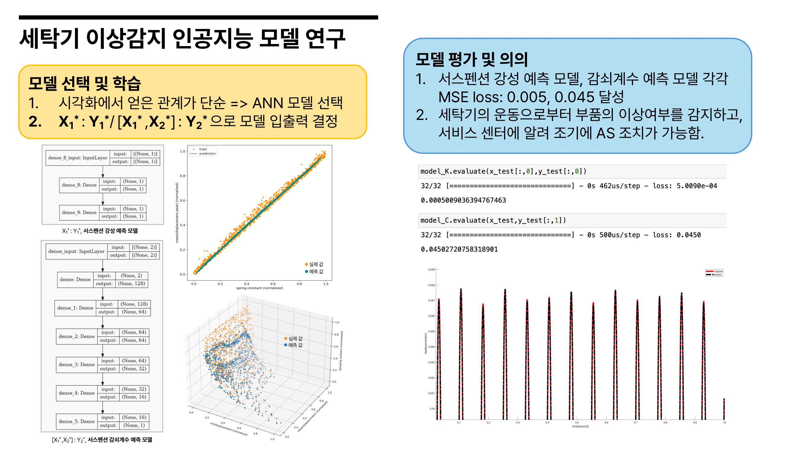 

## English Version
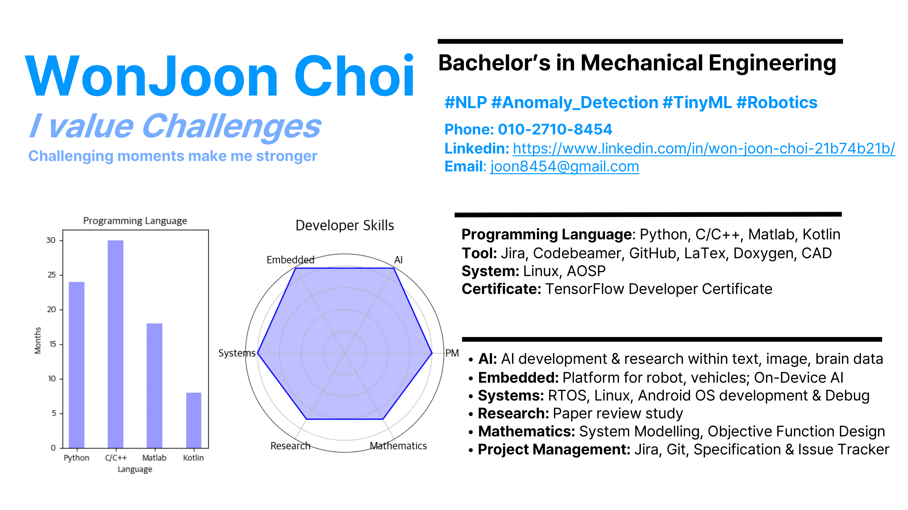
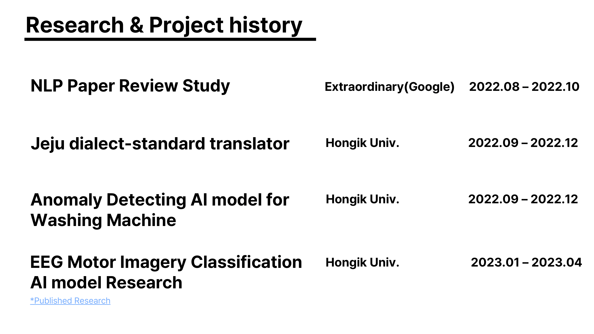
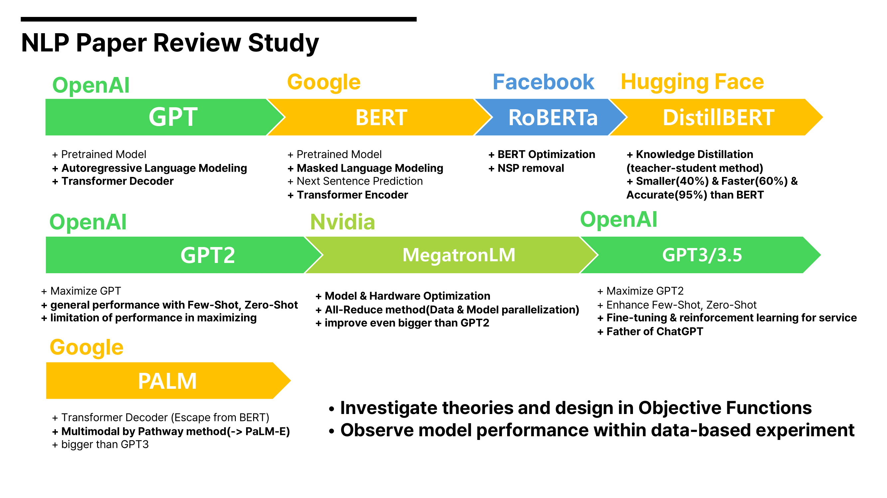
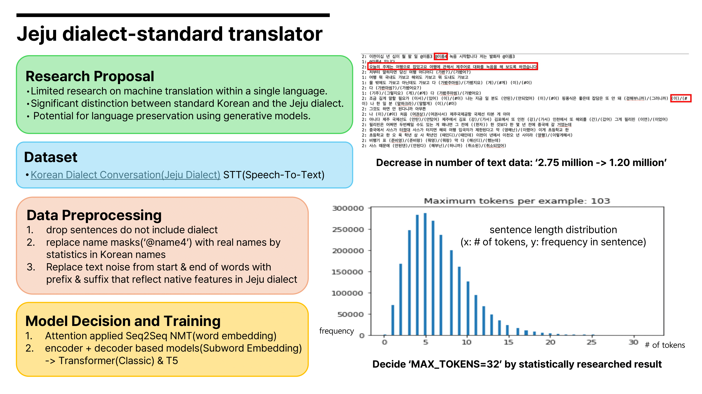
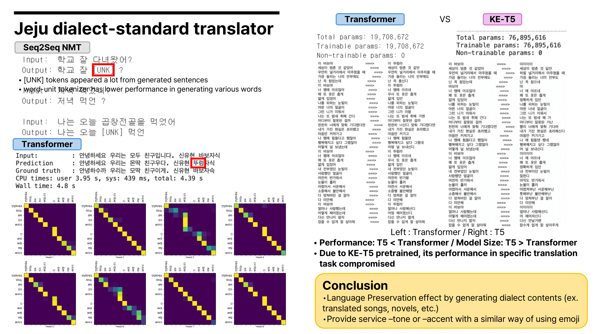
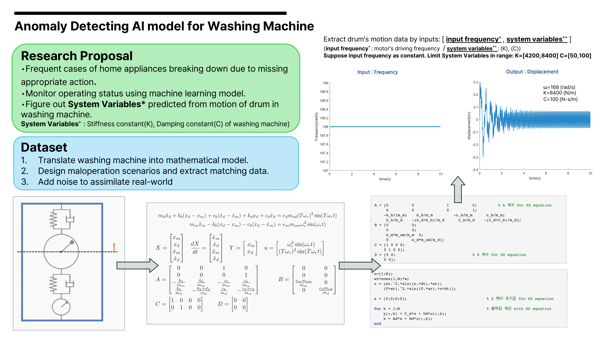
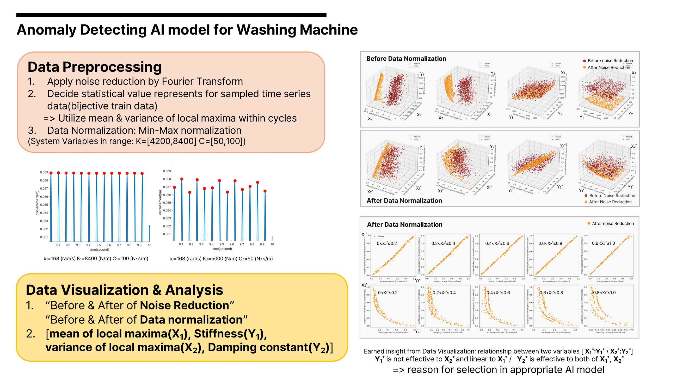
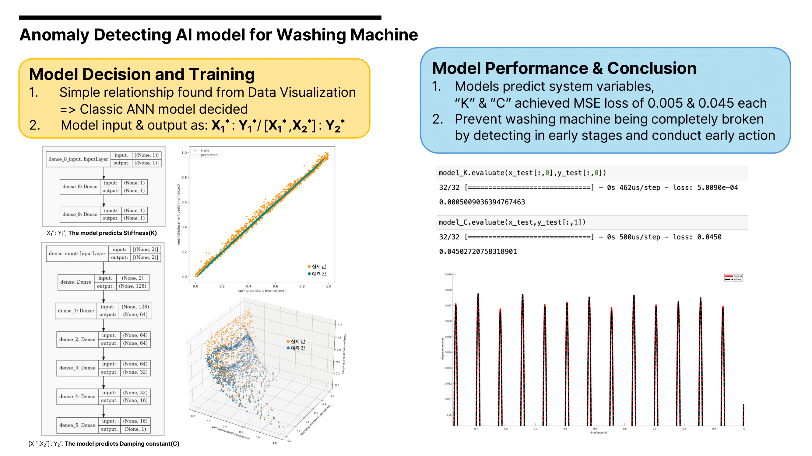 

Currently working on,
* AOSP for Automotives
* Covesa SOME/IP
* Jetpack Compose 
* 내일은 타자왕 - 코테 준비

2024.05.23
